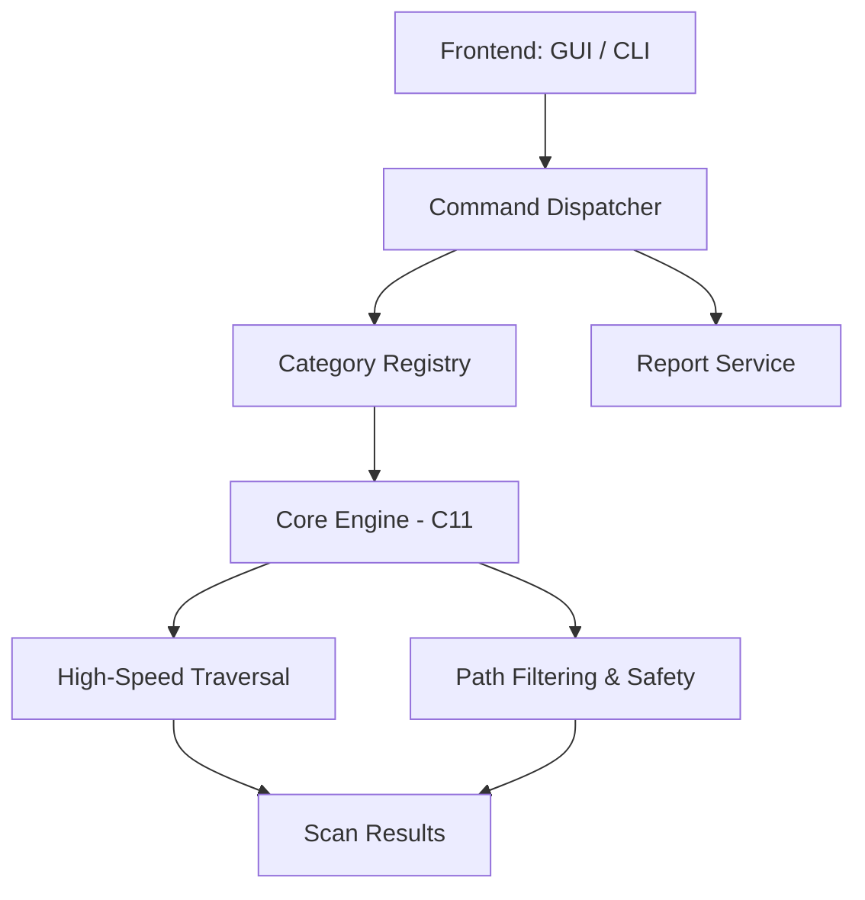

# Fcasher

```text
   ______ ______    ___   _____ __  __ ______ _____
  / ____// __  /   /   | / ___// / / / ____// __ \
 / /_   / /       / /| | \__ \/ /_/ / __/  / /_/ /
/ __/  / /       / ___ |___/ / __  / /___ / _, _/
/_/   /____/    /_/  |_/____/_/ /_/_____//_/ |_|
                 F C A S H E R
```


---

**Fcasher** is a high-performance Windows utility for cache inspection and controlled cleanup. It bridges the gap between old-school reliability and modern system analysis.

---

## 🎮 The Dual-Front-End Experience

Fcasher provides two distinct ways to interact with your system:

*   **The Classic GUI**: A native Win32 interface built with traditional controls. It fits perfectly on anything from a Windows 2000 workstation to a Windows 11 powerhouse.
*   **The Retro CLI**: A specialized terminal experience that recreates the "blue-screen" console aesthetic, featuring an **Interactive Launcher** for real-time command execution.

---

## 🚀 Key Features

| Feature | Description |
| :--- | :--- |
| **Interactive Mode** | A persistent shell for running multiple scans and analyses without restarting. |
| **Presets** | Ready-to-use profiles like `quick-sweep`, `browser-focus`, and `graphics-stack`. |
| **Advanced Filtering** | Filter by size (e.g. `--min-size 16MB`), age, and sort by relevance. |
| **Deep Analysis** | Identify directory hot-spots and ranked lists of largest/oldest files. |
| **Transparency** | Per-file rationale explains *why* a file is considered removable. |

---

> [!IMPORTANT]
> **Safety Model**
> Fcasher is intentionally conservative. It skips `System32`, `WinSxS`, and `Program Files`. It will not touch user documents or registry state. Real cleanup always requires a preview scan and explicit confirmation unless `--yes` is used.

---

## 🛠️ Quick Start

### Build Requirements
*   **CMake 3.18+**, **C11**, and **C++17** compilers.

```powershell
# Build the project
cmake -S . -B build
cmake --build build --config Release

# Run tests
ctest --test-dir build --output-on-failure
```

### CLI Usage Examples

```powershell
# Launch the Retro Interactive Shell
fcasher_cli

# Direct Command: Analyze large files across all categories
fcasher_cli analyze --all --min-size 8MB --sort size --limit 40

# Direct Command: Preview a quick sweep
fcasher_cli preview --preset quick-sweep --sort size --limit 25
```

---

## 🏗️ Architecture Overview



### Component Breakdown
*   **Application Layer (C++17)**: Handles the Win32 shell, CLI interactive loop, and session orchestration.
*   **Discovery Layer (C++17)**: Dynamic Windows path resolution and category management.
*   **Atomic Core (C11)**: Low-level traversal and cleanup logic for absolute performance and legacy compatibility.

---

## 📂 Project Structure

```text
Fcasher/
├── include/
│   ├── app/      # CLI, Interactive shell, and Orchestration
│   ├── gui/      # Native Win32 UI components
│   ├── core/     # Atomic C scanning/cleanup engine
│   └── platform/ # Windows-specific path discovery
├── src/
│   ├── app/      # Business logic & Interactive Loop
│   ├── gui/      # WinMain & Window Procedures
│   └── main.cpp  # Entry point with Retro Console init
└── tests/        # Comprehensive unit & integration tests
```

---

## 🗺️ Roadmap

- [ ] **Background Workers**: Keep the GUI responsive during million-file scans.
- [ ] **Enhanced Discovery**: Multi-profile browser support (Chrome, Firefox, Edge).
- [ ] **Tree Hygiene**: Safe removal of empty directory structures in temp roots.
- [ ] **Reporting**: Richer JSON schemas for enterprise automation.

---

---

## 🛠️ Compatibility & Ecosystem


---

## ⚖️ License

Distributed under the **MIT License**. See [LICENSE](LICENSE) for details.

---


